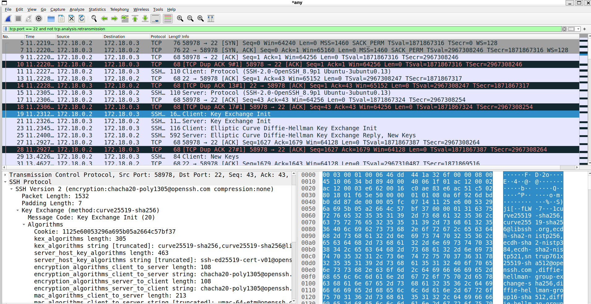

# TP: Telnet vs SSH with Docker & Wireshark (Ubuntu)

## Objective
This lab demonstrates the **security difference between Telnet and SSH** using Docker containers and Wireshark.

- Telnet: credentials and data are sent **in clear text**
- SSH: authentication and data are **encrypted**
- Wireshark runs on the **host machine** to capture container-to-container traffic

---

## Architecture

- Host machine (Ubuntu)
  - Docker
  - Wireshark
- Docker bridge network
- Two Ubuntu containers:
  - `server`: runs Telnet server + SSH server
  - `client`: runs Telnet client + SSH client

Traffic flow:
```
client  <---- Docker bridge ---->  server
                 |
             Wireshark
```

---

## 1. Install Docker (Official Method)

### Update system
```bash
sudo apt update
```

### Install prerequisites
```bash
sudo apt install -y ca-certificates curl gnupg lsb-release
```

### Create keyrings directory (best practice)
```bash
sudo mkdir -p /etc/apt/keyrings
```

### Add Docker GPG key
```bash
curl -fsSL https://download.docker.com/linux/ubuntu/gpg | sudo gpg --dearmor -o /etc/apt/keyrings/docker.gpg
```

**Why?**
- Docker signs its packages
- APT verifies integrity & authenticity using this key
- Prevents tampered or fake packages

### Add Docker repository
```bash
echo "deb [arch=$(dpkg --print-architecture) signed-by=/etc/apt/keyrings/docker.gpg] https://download.docker.com/linux/ubuntu $(lsb_release -cs) stable" | sudo tee /etc/apt/sources.list.d/docker.list > /dev/null
```

### Install Docker Engine
```bash
sudo apt update
sudo apt install -y docker-ce docker-ce-cli containerd.io docker-compose-plugin
```

### Allow Docker without sudo
```bash
sudo usermod -aG docker $USER
newgrp docker
```

Verify:
```bash
docker --version
```

---

## Let's Go Play With Docker
Before jumping into Telnet and SSH, take a quick hands-on tour of Docker basics:

- `docker_playground_basics/00_overview.md`
- `docker_playground_basics/01_images.md`
- `docker_playground_basics/02_containers.md`
- `docker_playground_basics/03_volumes.md`
- `docker_playground_basics/04_networks.md`
- `docker_playground_basics/05_cleanup.md`

---

## 2. Create Docker Network
```bash
docker network create tp-net
```

---

## 3. Start Containers

### Server container
```bash
docker run -dit --name server --network tp-net ubuntu:22.04 bash
```

### Client container
```bash
docker run -dit --name client --network tp-net ubuntu:22.04 bash
```

---

## 4. Configure SERVER (Telnet + SSH)

```bash
docker exec -it server bash
```

### Install required packages
```bash
apt update
apt install -y iproute2 inetutils-inetd telnetd openssh-server passwd
```

### Create demo user
```bash
useradd -m demo
passwd demo
```

### Enable Telnet (insecure)
```bash
echo "telnet stream tcp nowait root /usr/sbin/tcpd /usr/sbin/in.telnetd" >> /etc/inetd.conf
service inetutils-inetd restart
```

### Enable SSH
```bash
mkdir -p /var/run/sshd
sed -i 's/#PasswordAuthentication yes/PasswordAuthentication yes/' /etc/ssh/sshd_config
service ssh start
```

### Get server IP
```bash
ip a
```

Exit:
```bash
exit
```

---

## 5. Configure CLIENT

```bash
docker exec -it client bash
```

```bash
apt update
apt install -y iproute2 telnet openssh-client
exit
```

---

## 6. Install & Configure Wireshark (Host)

```bash
sudo apt install -y wireshark
sudo dpkg-reconfigure wireshark-common   # choose YES
sudo usermod -aG wireshark $USER
newgrp wireshark
sudo apt install iputils-ping
```

Run:
```bash
wireshark
```

Capture interface:
- `docker0` or `br-xxxx`

### Provided capture file
You can also open the pre-captured Wireshark file in the project root:

- `wireshark_ssh`

---

## 7. Telnet Experience (Clear Text)

### Open the client container
```bash
docker exec -it client bash
```

### Connect with Telnet
```bash
telnet <SERVER_IP>
```

Login:
```
demo / demo
```

### Wireshark filter
```text
tcp.port == 23
```

**Observation:**
- Username visible
- Password visible
- Full session readable

Exit Telnet:
```
exit
```

Exit container:
```
exit
```

---

## 8. SSH Experience (Encrypted)

### Open the client container
```bash
docker exec -it client bash
```

### Connect with SSH
```bash
ssh demo@<SERVER_IP>
```

### Wireshark filter
```text
tcp.port == 22
```

**Observation:**
- Key exchange packets
- Encrypted application data
- No readable credentials

Exit SSH:
```
exit
```

Exit container:
```
exit
```

### Provided screenshot


---

## 9. Conclusion

| Protocol | Encryption | Credentials Visible |
|--------|------------|---------------------|
| Telnet | ❌ No | ✅ Yes |
| SSH | ✅ Yes | ❌ No |

**SSH replaced Telnet because security is mandatory on modern networks.**

---

## Helpful Videos
- SSH key exchange overview: `https://www.youtube.com/watch?v=o9AdiGjOb_I`

---

## Algorithm Used By SSH (Key Exchange)
SSH uses **ECDH (Elliptic Curve Diffie-Hellman)** with **X25519** during the key exchange phase. This lets the client and server agree on a shared secret over an insecure network without sending the secret itself. That shared secret is then used to derive encryption keys for the session, as shown in the picture below.

---

## 10. Cleanup (Optional)
```bash
docker rm -f server client
docker network rm tp-net
```

---

## Educational Outcome
- Understand plaintext vs encrypted protocols
- Learn Docker networking basics
- Learn how Wireshark captures real traffic
- Visual proof of why Telnet is insecure
